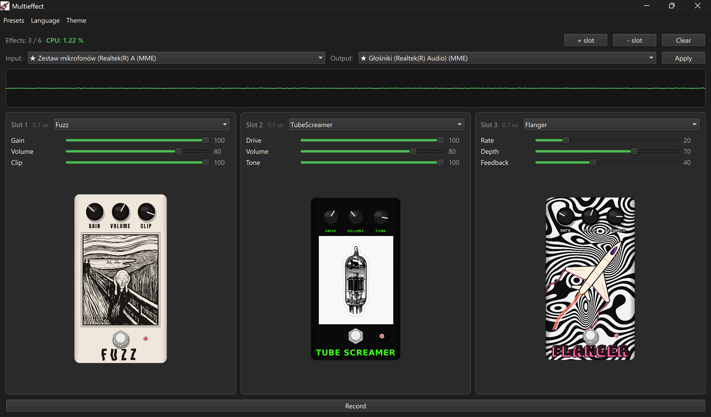
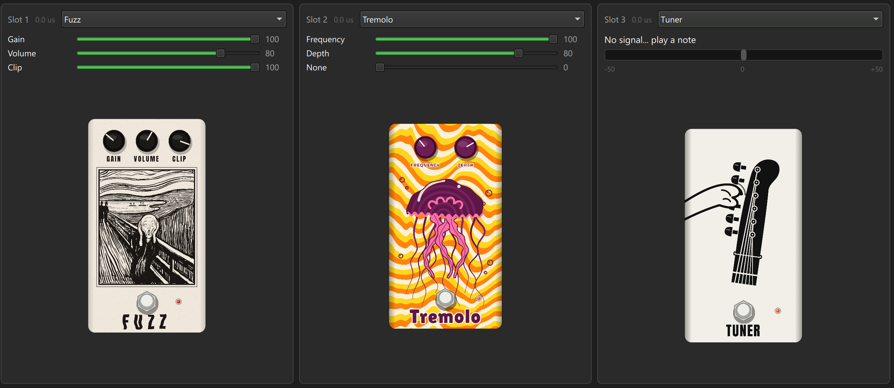
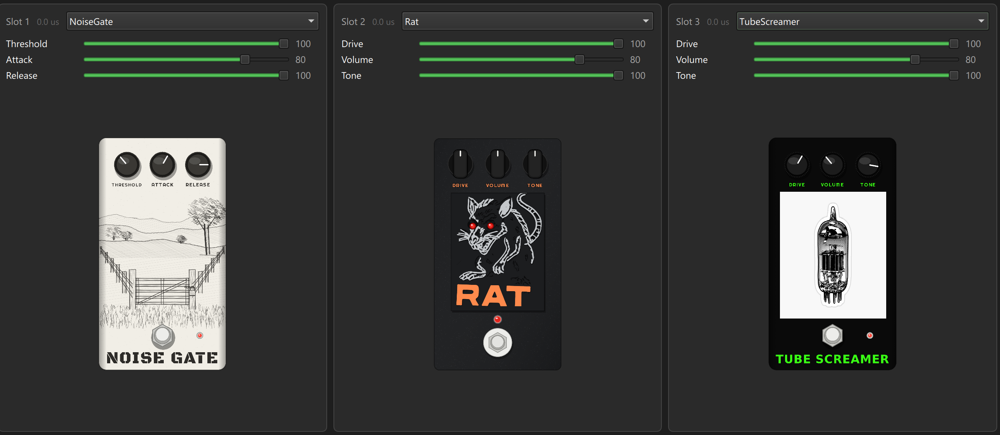
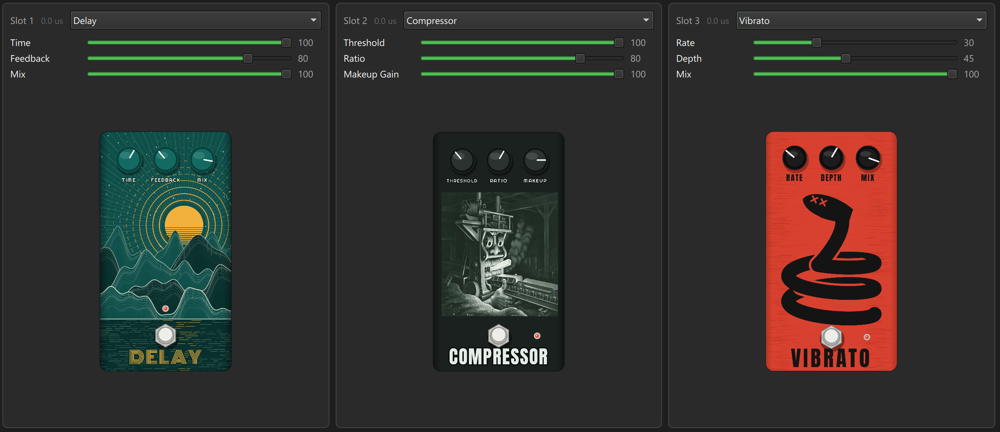
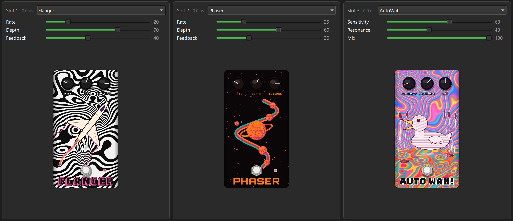

# Multieffect

A real-time guitar multi-effect processor with a Qt Quick GUI.

## App view

## Features

- Chain of up to 6 effect slots, each with its own effect and 3 parameters
- 14 built-in effects (see below), picked from a dropdown per slot, with artwork
- Animated tuner (pitch detection)
- CPU load meter (total and per-slot)
- Live oscilloscope of the output signal
- Recording to WAV
- Save, load, and delete presets
- Audio input/output device selection
- Light/dark theme, English/Polish UI language

## Effects

| Effect | Category |
|---|---|
| Fuzz | distortion |
| Rat | distortion |
| TubeScreamer | distortion |
| Boost | clean gain + tone |
| Compressor | dynamics |
| NoiseGate | dynamics |
| Delay | time-based |
| Tremolo | modulation (LFO on volume) |
| Vibrato | modulation (LFO on pitch) |
| Flanger | modulation |
| Phaser | modulation |
| AutoWah | envelope-driven filter |
| Equalizer | static filter (3-band, biquad) |
| Tuner | pitch detection (McLeod method) |

## Effects art

<table>
  <tr>
    <td></td>
    <td></td>
  </tr>
  <tr>
    <td></td>
    <td></td>
  </tr>
</table>

## Building

The GUI lives in `gui/` and builds with CMake + Qt6.

Requirements:
- Qt6 (Quick, QuickControls2) — install via the official Qt Online Installer
- PortAudio — via [vcpkg](https://github.com/microsoft/vcpkg)

Open the `gui/` folder in Qt Creator (or any CMake-aware IDE) — it's
detected automatically as a CMake project. Build and run.

## Notes

- Plug in your audio interface before starting the app — the device list
  doesn't refresh while a stream is already running.
- Effect artwork goes in `gui/assets/effects/<name>.png` (lowercase effect
  name); the app falls back to a placeholder hint if a file is missing.
